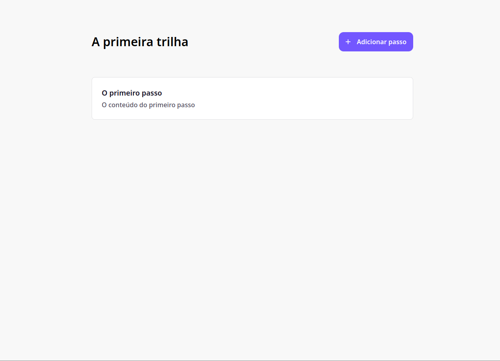
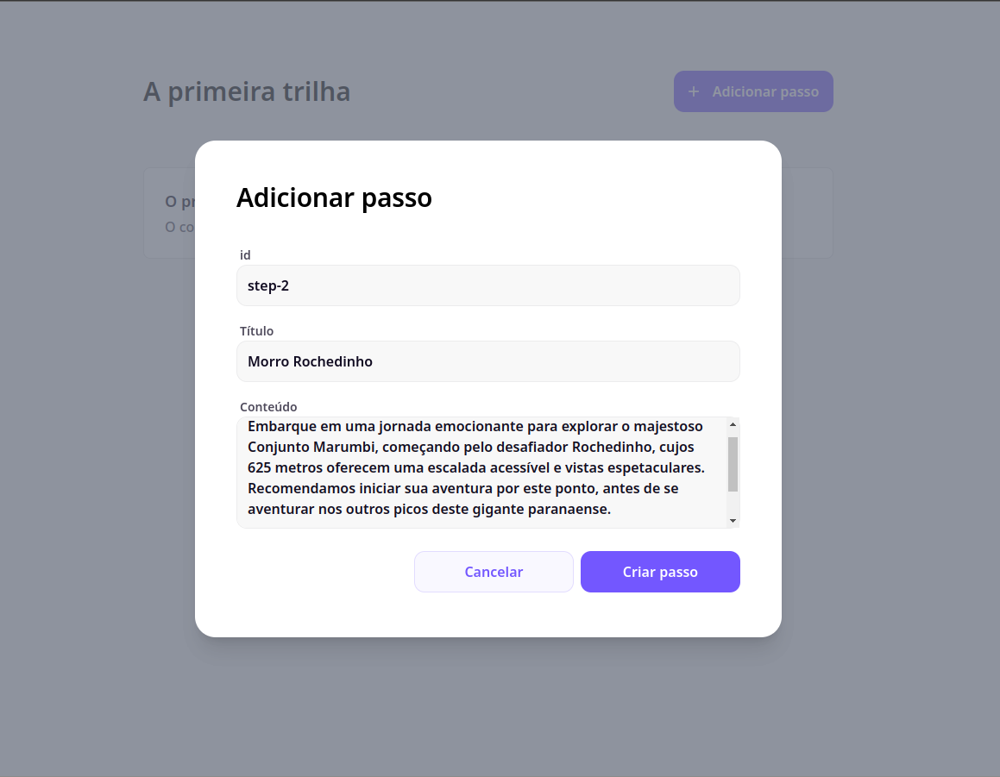
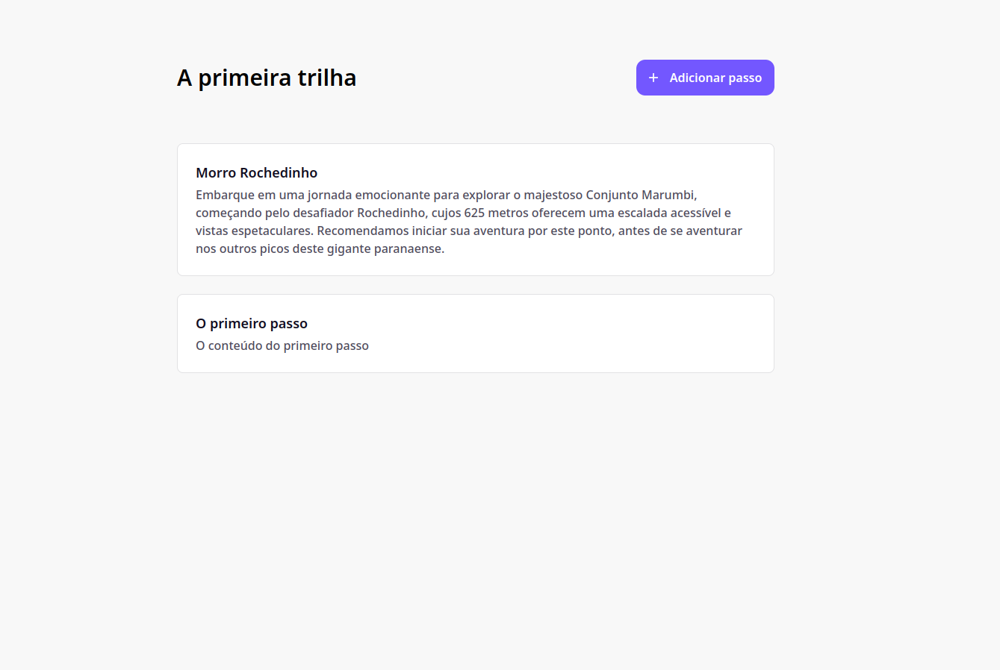
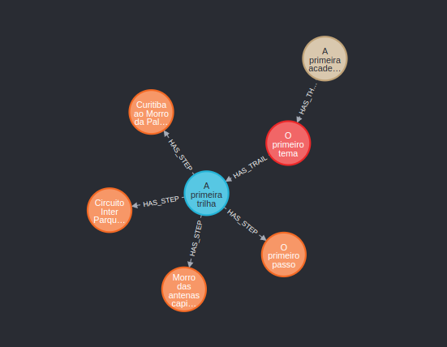

<p style="display:flex;justify-content:center;align-items:center;" align="center">
  <a href="https://remix.run/" target="blank"></a>
  <span style="font-weight:900; font-size:30px;margin:0 10px;color:white">+</span>
  <a href="https://neo4j.com/" target="blank"></a>
</p>

# REMIX + Neo4j
## Overview
This project demonstrates a powerful approach to building data-driven applications using Remix, a modern full-stack web framework, and Neo4j, a popular graph database. It empowers you to connect to Neo4j, create nodes and relationships, and seamlessly integrate this graph data into your front-end components for a dynamic and visually engaging user experience.

## Features
- **Robust Graph Connectivity:** Leverage the power of Remix to seamlessly connect to your Neo4j database, enabling you to create new nodes and relationships.
- **Intuitive Front-End Data Rendering:** Remix's data fetching capabilities make it easy to render graph data within your front-end components, providing a visually compelling representation of your interconnected information.
- **Clean and Modular Architecture:** Benefit from Remix's inherent structure that promotes modularity and maintainability, allowing for easier code organization and future enhancements.

## Prerequisites
- **Node.js:** Ensure you have Node.js version 20.11.1 or later installed on your development machine. You can download it from the official Node.js website: https://nodejs.org/en
- **Docker Compose:** Make sure you have Docker Compose version 2.27.0 or later installed. Instructions for installation can be found in the official Docker documentation: https://docs.docker.com/compose/install/

## Installation
Clone this repository:

```Bash
git clone https://github.com/julianopedraca/remix-neo4j.git
```
Navigate to the project directory:
```Bash
cd remix-neo4j
```

Install project dependencies:

```Bash
npm install
```
Start Neo4j using Docker Compose:

```Bash
docker-compose up
```
This command will build and run the necessary Docker containers for Neo4j.

## Start the development server:

```Bash
npm run dev
```
This command will start the Remix development server, typically accessible at http://localhost:5173 by default.

## Routes
**/explore/trail-1:** Get all steps from trail and use it to render those infomations on the screen, showing the title of the trail and cards with the step information

## Project Structure
```
routes
  |- api-neo4j // connections and queries for neo4j
  |   |- create-nodes.neo4j.tsx // create starter nodes
  |   |- query.neo4j.tsx // module to run queries
  |
  |- components
  |   |- button.component.tsx //create reusable button component
  |   |- card.component.tsx //create reusable card component
  |   |- dialog.component.tsx //create reusable dialog component
  |
  |- explre.tsx // main route of the application
enums
  |- queries.enum.ts
interfaces
  |- button-props.interface.ts
  |- card-props.interface.ts
  |- modal-status.interface.ts
  |- queries.interface.ts
```
## Showcase




